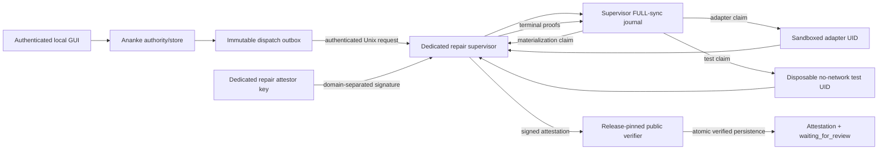

Working...
# DESIGN CHANGES REQUESTED

The replacement direction is sound, but the current section is not implementable as a machine-verifiable security contract. It leaves trust bootstrap, claim ownership, descendant termination, test capability, Git-admin mutation, and signing-role semantics ambiguous. Those gaps can reproduce the first review’s failures behind a supervisor signature.

## Blocking ambiguities

### 1. The public trust bundle is not yet an anchor

Current P5 verification validates a bundle internally, but the bundle itself is caller-selected:

- `trustedsupervisor.NewClient` accepts `Config.TrustBundle`: `internal/trustedsupervisor/client.go:48-50`.
- The transport CLI reads an operator-selected `--trust-bundle` path: `cmd/ananke-trusted-supervisor-transport/main.go:47-72`.
- `DecodeTrustBundle` verifies the bundle’s internal signatures but does not compare it with an external release pin: `internal/trustedsupervisor/client.go:78-88`.
- Existing store persistence accepts a caller-provided `ExternalSupervisorAuthenticator`: `internal/store/external_supervisor_authenticated_persistence.go:15-52`. A permissive implementation can therefore substitute verification.

A self-consistent attacker-generated root, certificate, and attestation are not trust.

**Required correction**

- The Ananke release must pin the exact repair trust-bundle hash and repair-attestor leaf SPKI outside the mutable SQLite database—preferably in the signed release manifest/build identity.
- Startup may load a public bundle from a file only if:
  - the file identity is pinned and opened without following links;
  - the canonical bundle hash equals the release pin;
  - its repair-attestor certificate and root lifecycle validate;
  - its leaf SPKI equals the release-pinned SPKI.
- The database may record that hash but cannot initialize or replace it.
- No `PersistRepairAttestation(..., verifier Interface)` API. Verification must be an internal mandatory step using the release-pinned verifier.
- Root rotation requires an explicit cross-signed, release-approved contract. No trust-on-first-use and no runtime “install trust bundle” store API.
- A raw database owner may insert bytes, but every state read must reject `waiting_for_review` unless the corresponding signature verifies against the external release pin.

Until this is frozen, a store-only caller can swap the verifier rather than forge Ed25519.

---

### 2. Existing P5 leaf signing material cannot be reused unchanged

The current private bundle permits exactly one key and fixes its role to `independent_supervisor_protocol_adapter`:

- `internal/trustedsupervisor/server_keys.go:94-103`.
- Current verification requires that exact certificate role: `internal/trustedsupervisor/client.go:544-553`.
- Current wire operations are only `deliver`, `reconcile`, and `cancel`: `internal/trustedsupervisor/protocol.go:16-28`.
- The server explicitly states that it is read-only and has no repair capability: `internal/trustedsupervisor/server.go:60-61`.
- Existing message signatures bind the P5 message shape, not a repair-review domain: `internal/trustedsupervisor/server_protocol.go:539-564`.

Using the same leaf key for repair attestations would expand a protocol-adapter certificate into an effect-attestor certificate and create cross-protocol confusion.

**Required correction**

Reuse the P5 cryptographic and Unix-transport machinery, not the current leaf identity:

- Introduce a distinct leaf role, e.g. `controlled_repair_review_attestor`.
- Use a distinct Ed25519 leaf key and certificate under the existing release-root lifecycle.
- Use an explicit signature domain such as `ananke.controlled-repair.review-attestation.v1`.
- Version the private key bundle to carry separate protocol and repair keys, or preferably run a separate `ananke-controlled-repair-supervisor` with its own key bundle, socket, journal, policy, and runtime UID.
- Ananke receives only the repair public certificate/trust bundle. The private repair key remains exclusively in the repair-supervisor process and is zeroed on shutdown using the existing key-custody pattern.

The existing P5 read-only server should not silently become repair-capable. A separate service preserves the already-reviewed P5 boundary.

---

### 3. “One-shot claim” needs an authoritative journal and at-most-once semantics

The proposal does not say where the claim lives or distinguish a committed claim from a launched effect. Exactly-once effects are impossible across:

```text
commit claim → crash → launch effect
commit claim → launch effect → crash before completion record
```

The current supervisor journal has useful immediate/FULL durability machinery—`internal/trustedsupervisor/server_journal.go:80-124`, `149-282`—but existing audit recovery is unsuitable: an intent with no events is automatically executed after restart at `internal/trustedsupervisor/audit_runtime.go:265-288`.

**Required correction**

The supervisor-owned journal is the sole claim authority. Ananke may mirror signed claim receipts but cannot own the effect claim.

Freeze three unique phase claims:

1. `materialization_claim` — committed before the first worktree/common-`.git` mutation.
2. `adapter_claim` — committed before spawning the adapter.
3. `test_claim` — committed before creating or spawning the test sandbox.

Each claim must bind:

- authorization, policy, full P4/fence, attempt, request and channel hashes;
- phase and predecessor claim/event hashes;
- supervisor boot/process epoch;
- policy, repository, executable, sandbox-profile, and planned namespace identities;
- monotonically increasing sequence and unique `(attempt_hash, phase)`.

Semantics:

- Commit, validate, and `FULL`/`fullfsync` the claim before effect.
- Only the live executor that received successful commit confirmation may enter the phase.
- Duplicate callers return the stored claim/result and perform no effect.
- No background sweep executes an unclaimed or claimed intent after restart.
- Any nonterminal claim from an earlier supervisor epoch becomes signed `waiting_for_human`; it is never resumed.
- A crash after claim may produce zero effects. The guarantee is **at-most-once automatic launch**, not exactly once.
- Attempt 2 requires a new fresh human authorization and a new attempt/claim chain.

---

### 4. macOS sandbox inheritance is effect containment, not terminal-process proof

The existing Seatbelt profiles deny by default and can deny network/write authority, but they explicitly allow forks:

- `internal/trustedsupervisor/audit_executor.go:1231-1287`.
- Current test lifecycle only confirms the leader and original process group: `internal/trustedsupervisor/audit_executor.go:1116-1207`.
- Termination uses negative-PGID signalling: `internal/trustedsupervisor/cancellation_process.go:93-105`.
- The current supervisor has one configured runtime UID shared across executions: `cmd/ananke-trusted-supervisor/main.go:44-65`; `internal/trustedsupervisor/namespace_authority.go:122-165`.

A child that calls `setsid`, closes inherited pipes, and reparents can leave the tracked PGID while retaining the inherited sandbox. The sandbox limits damage but does not prove the process is gone. Signing while such a process exists reintroduces late mutation and resource-consumption races.

**Required terminal proof before signing**

Use a dedicated runtime UID for the attempt, or an exclusive UID lease from a closed pool:

1. Persist the UID lease in the supervisor journal before spawn.
2. Do not run two attempts under the same leased UID.
3. Apply the Seatbelt profile and deny credential changes.
4. On completion/timeout:
   - wait/reap the exact leader;
   - TERM/KILL the original process group;
   - enumerate and kill every process with the leased UID, including new sessions;
   - repeat until the UID has no processes;
   - only then freeze/verify writable roots.
5. Close all supervisor pipes and descriptors associated with the sandbox.
6. For tests, scrub and remove the disposable root and prove it absent.
7. Persist a terminal-proof record binding the UID lease, leader identity, process-group proof, UID-empty proof, sandbox-profile hash, root identities, and cleanup result.
8. Sign only after that record is durably committed.

Once the UID process set reaches zero, no remaining process can create a later descendant. If reliable UID-wide enumeration/termination cannot be provided on the supported macOS version, use a stronger managed-job/VM boundary; PGID plus Seatbelt is insufficient.

Permanent RED vectors must include double-fork, `setsid`, closed stdio, delayed write, delayed local-ref update, and supervisor restart while the child remains alive.

---

### 5. “Closed test profiles” must define a bounded Go capability

A test profile can support useful Go tests without arbitrary push/network authority, but not every Go project test.

Current P5 policy already pins command identities and arguments, `internal/trustedsupervisor/execution_policy.go:126-153`, but its generic profile permits broad executable roots and caller-installed policy argv. The replacement needs a narrower repair-test schema.

**Required P6a Go profile**

Ananke authorizes only ordered profile IDs and hashes. It never supplies executable paths, argv, environment, working directory, or cache locations.

A supervisor-installed, release-pinned profile should bind:

- exact root-owned Go toolchain manifest and `go` executable identity;
- exact fixed command, for example `go test ./... -count=1 -mod=readonly`;
- timeout/output/resource bounds;
- canonical environment:
  - `CGO_ENABLED=0`
  - `GOENV=off`
  - `GOTOOLCHAIN=local`
  - `GOPROXY=off`
  - `GOSUMDB=off`
  - `GOVCS=*:off`
  - `GOWORK=off`
  - private `HOME`, `TMPDIR`, and `GOCACHE`;
- a release-pinned, read-only pre-populated module cache manifest;
- the sandbox-profile hash and runtime UID policy.

The sandbox receives:

- a fresh candidate source copy or archive, not the retained review worktree;
- no `.git` directory, Git credentials, remotes, original repository, common Git directory, or supervisor journal/key paths;
- no network;
- read-only source where supported;
- writable build/cache/temp roots only inside the disposable root;
- process execution limited to the pinned Go toolchain and binaries produced inside that disposable root.

A test may compile and execute arbitrary project test code, but that code remains unable to reach network, external refs, the retained worktree, or files outside the disposable root.

**P6a non-goals must include:** cgo, tests requiring network, integration services, mutable external caches, Git metadata, or missing module downloads. Such projects fail closed or require a later separately reviewed profile.

---

### 6. Worktree and common-`.git` authority remain underspecified

`git worktree add` necessarily mutates the original common Git administration directory. Therefore “original repository unchanged” must distinguish forbidden changes from the one permitted administrative subtree.

Freeze these rules:

- Pin the repository top-level and common `.git` directory by descriptor, device/inode/owner/mode.
- Pin and hash:
  - local config;
  - `HEAD`;
  - all refs;
  - object inventory;
  - index;
  - hooks and attributes/config inputs;
  - existing worktree registry.
- Before any mutation, reject effectful config, `extensions.worktreeConfig`, filters, fsmonitor, hooks, external diff/textconv, credentials, includes, and protocol helpers.
- The only permitted original-admin delta is creation of the claim-derived `.git/worktrees/<name>` subtree by the supervisor’s fixed `worktree add --detach --no-checkout` operation.
- No ref, branch, config, original index, or object database delta is permitted.
- Record and revalidate the new admin subtree identity and `.git` file contents.
- The adapter sandbox must have no write access to the common `.git`, worktree `.git` file, config, hooks, attributes administration, or worktree admin directory.
- Supervisor diff verification begins only after adapter terminal proof.
- Candidate scans must include ignored entries as well as ordinary untracked entries and independently reconcile filesystem, status, raw, numstat, and patch views.
- Tests operate on a disposable candidate copy, never the retained worktree.

Cleanup authority must be split:

- Disposable adapter/test transient roots may be removed only after terminal process proof.
- The review worktree and its common-`.git` admin subtree are never automatically removed or pruned.
- Partial worktree/admin state after an ambiguous claimed phase is retained and reported `waiting_for_human`.
- P6a exposes no cleanup, prune, remove, commit, branch, push, merge, or ref-update operation.

---

### 7. The attestation and persistence contract is still prose

The signed object must be frozen before storage code. At minimum it must contain:

- schema version and signature domain;
- attestation ID/hash, issuance time, trust-bundle hash;
- repair-attestor certificate hash, root ID, and leaf SPKI;
- transport request, response nonce, and channel-binding hashes;
- full P4 durable-fact hash and complete fence tuple;
- authorization, policy, approval, attempt, and all phase-claim hashes;
- approval effect-time validation timestamp;
- pre-effect repository/common-`.git`/Git-executable identities;
- worktree parent, target, admin directory and retained-worktree descriptor hashes;
- adapter profile/identity/result and terminal-proof hashes;
- diff patch hash/size, ordered paths, and status/raw/numstat/ignored-scan hashes;
- ordered test profile hashes, command identities, results, bounded output hashes/sizes;
- test sandbox and terminal/cleanup proof hashes;
- exact supervisor journal event head and predecessor hashes;
- state exactly `waiting_for_review`.

The Ed25519 signature covers canonical bytes of the entire attestation, excluding only the signature field, with explicit domain separation.

Ananke persistence must:

1. Load the release-pinned verifier internally.
2. Reconstruct and verify every durable P4/authorization/attempt binding.
3. Verify signer role, certificate, root validity/revocation at attestation issuance time, signature, delivery freshness, and exact current attempt head.
4. Reject an attestation from another request, attempt, claim, worktree, policy, signer, or trust bundle.
5. Atomically insert immutable attestation bytes and the sole `waiting_for_review` event.
6. On exact replay, return the same row without transport or effect.
7. Refuse any unsigned or generic state-transition route.

The existing pattern of accepting an injected authenticator at the store boundary must not be copied.

---

### 8. The plan remains internally contradictory

The correction says it supersedes the old plan, but the same document still instructs implementation of:

- `internal/repairrunner` and an injected adapter: lines 44, 106-126;
- caller-side executable/argv tests: lines 59 and 98;
- fake in-process adapter execution: line 183;
- unsigned runner-owned evidence/persistence tasks: lines 152-169.

A preface is not a frozen cutover. The superseded tasks must be removed or replaced before implementation begins. Otherwise two incompatible architectures remain actionable.

## Concrete corrected architecture



Trust boundaries:

- **Trusted:** authenticated GUI authorization path, whole Ananke process for dispatch, release-pinned public verifier, dedicated repair supervisor and its journal/policy/key handling.
- **Untrusted:** OMP adapter, project source/tests, compiled test binaries, sandbox descendants, retained candidate contents before independent verification.
- **No private key in Ananke.**
- **No effect authority in the store package.**
- **No production in-process adapter.**
- **No caller-selected test command.**

## Contracts that must be frozen before code

1. **Trust bootstrap and rotation contract**
   - release pin, bundle/certificate roles, separate repair leaf, no TOFU.
2. **P6 authorization and dispatch contract**
   - GUI provenance, age/TTL/effect expiry, full P4/fence/policy binding, outbox and Unix-peer identity.
3. **Supervisor intent/claim/recovery contract**
   - phase claims, boot epoch, at-most-once semantics, concurrency, crash transitions.
4. **Repository/worktree authority contract**
   - exact permitted common-`.git` delta, config/attributes closure, retained/ambiguous worktrees, no cleanup authority.
5. **Adapter sandbox contract**
   - provider-free production absence now; future executable/profile/credential/network/write/UID boundary.
6. **Go test-profile contract**
   - fixed offline profiles, toolchain/cache manifests, disposable root, terminal proof, explicit unsupported test classes.
7. **Repair-review attestation contract**
   - canonical fields, signature domain, signer role, claim/effect/terminal bindings.
8. **Ananke verification and persistence contract**
   - non-injectable pinned verifier, atomic attestation/event pair, exact replay, no unsigned transition.
9. **Pre-release schema cutover contract**
   - remove rejected APIs and tables. Because v15/v16 are unreleased, prefer squashing them rather than shipping an obsolete unsigned schema plus v17. If preserving numbering is unavoidable, v17 must reject populated rejected rows and no reader may recognize them.

## Required TDD phases after contract review

1. Trust-anchor substitution, rotation, role-confusion, and permissive-verifier RED vectors.
2. Claim concurrency and crash matrix for every pre/post-commit and pre/post-launch boundary.
3. Worktree/common-`.git` identity and forbidden-delta probes.
4. Adapter sandbox and late-mutation probes, including restart.
5. UID-wide descendant probes: fork, double-fork, `setsid`, closed stdio, delayed mutation.
6. Closed offline Go profile: deny push, local ref update, network, original/worktree writes, arbitrary executable/argv, and missing modules.
7. Canonical attestation/signature/replay/conflict/store-only fabrication vectors.
8. Provider-free end-to-end flow ending only in verified `waiting_for_review`.
9. Production-binary proof: no in-process adapter, no rejected store API, no protocol key reused as repair attestor.

## Residual non-goals

- Exactly-once effects; the contract is at-most-once automatic launch.
- Automatic crash resume or retry.
- Real OMP repair provider integration.
- Networked, cgo, integration, or service-dependent tests.
- Commit, ref update, branch creation, push, merge, rollback, prune, or worktree deletion.
- Human accept/merge implementation.
- Attestation of future worktree immutability: human acceptance must revalidate the retained descriptor and candidate hash before acting.
